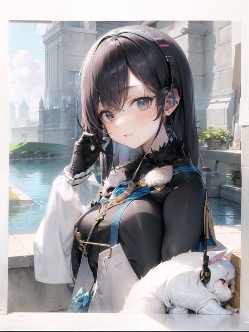

# 1. ShiroAi-chan and her friend Kiki-chan



### My attempt to create my anime waifu discord bot that can write and speak in cute voice.

### Description:
Discord bot, or as it is now duet of bots. ShiroAi-chan is a Virtual streamer on Twitch platform but now she is just chatting on Discord. She uses [ChatGPT API] as her brain and [Azure TTS] as her voice. Unfortunately I encountered a problem when I was working on her speech capabilities and I needed to use second bot to record questions on voice channel. Now ShiroAi-chan has a friend Kiki-chan that is kind of her interpreter.

### Her personality
* As for now she is Virtual streamer on Twitch platform that is off work and just chat on Discord with viewers. She is cat-girl and likes to answer with cat-style words. She is cheerful and likes joking.
  
## Some steps that she uses
### 1. Writing
* She uses [ChatGPT API] to generate responses.
* She has some slash commands to interact with her.


### 2. Her memory :heart_eyes:
* She uses [Azure SQL Database] to store her memories. She can remember up to 4 last questions, more is too expensive using [ChatGPT API].
* Every user has his own table in database and can reset it with command.


### 3. Give her voice! :microphone:
* **a) [ X ]** Using Microsoft [Azure TTS], send API with generated prompts to get audio file.


### 4. Some communications is needed :blush:
* **a) [ X ]** I can use web to show input and log from conversation or ~~build application on windows.~~ (web is easier for me) If I will use Speech-to-text, 


### Instructions for me:
1. To run Pygmalion locally: 
   * use this command in ***[KoboldAI]*** folder: 
     ```python
      python aiserver.py --noaimenu --host --port 8056 --model PygmalionAI/pygmalion-2.7B --revision main --nobreakmodel --lowmem
     ```
   * use this in ***GradioUI*** folder:
     ```python
     python src/app.py --koboldai-url "http://127.0.0.1:8056" --share 
     ```
     > --share is for sharing to ipv6 address via gradio


### How I imagine it to work from user side? (let's say it's after configuring all API keys etc, maybe some script for all that? :no_mouth: )
I expect it to work in this kind of order:
1. I open [Vtube studio] and load plugin to Lip Sync to audio, then load configuration file to load model and settings.
2. I open web page with gradio *(or windows app if I build it)* and see page with output and some window for chat log and buttons to sent message etc.
3. I write message in input, click enter *or button* and wait for response from my cute girl.
4. When I will get response from her in chat, audio file will play and avatar will play animation in [Vtube studio].

### But how will it look from back side?
I thing it should kinda look like this:
1. When I open [Vtube studio] I think I will run some script to open [Vtube studio] and plugin app and maybe some instructions in console.
2. I will need to start model if it's Pygmalion.
3. When I send message:
    *  prompt needs to be send to model to generate response. *If it's not Pygmalion I need to connect to database to retrieve old logs if there are some*.
4. When response is generated I need to:
    * sent it to [Azure TTS] to generate audio file.
      * then add SSML to this file to make it sound more human
    * then I need to analyze response, is it happy response, sad, ...
      * to do this I think two thinks needs to be done:
        * use another model to analyze text
        * use another model to analyze audio
    * then I need to choose best animations for this response based on emotions obtained from models
      * and send it to [Vtube studio] to start animation
5. Next step will be playing everything.
    * write response on website
    * play audio
    * play animation 
6. *Rinse, repeat ...*

## Progress for now
* I got it to work with [gradio]. 
  * There is some manual procedure, need to start [koboldAI] and [gradio] via Power Shell and [Vtube studio] with plugin.
  * **BUT!** I can converse and see response in chat log and hear her voice while she looks at me  :blush: :smile:

#### To do but small steps:
* #### Voice:
  * I need to delete wav file after it's played because it's starting when I am starting [gradio].
* #### Look :star_struck:
  * I need to record some animations in [Vtube studio].
  * [to do next] And i will need to use some combination of Sentiment Analysis and key words combinations to get needed info to play appropriate animation. Azure or something.


some raw thoughs: I NOW KNOW how to build request APi to koboldAI. Gradio is good when you want to use it as a web app. But to only get responses and use in antoher program, koboldAI is easier.

## Links 

[ChatGPT API] : https://openai.com/blog/introducing-chatgpt-and-whisper-apis

[Azure SQL Database] : https://azure.microsoft.com/en-us/products/azure-sql/database

[Azure TTS] : https://azure.microsoft.com/en-us/products/cognitive-services/text-to-speech/


[Azure SQL Database]: https://azure.microsoft.com/en-us/products/azure-sql/database
[ChatGPT API]: https://openai.com/blog/introducing-chatgpt-and-whisper-apis
[Azure TTS]: https://azure.microsoft.com/en-us/products/cognitive-services/text-to-speech/

