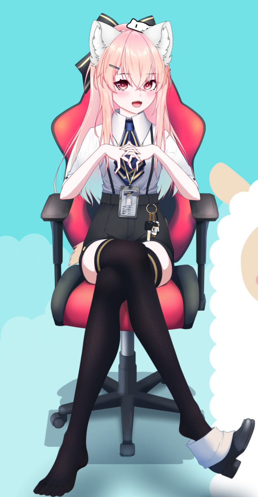

# 1. Shiro-AIchan



### My attempt to create my anime waifu with [Live2d] avatar

### Description:
AI anime waifu with [Live2d] avatar, using transformer chatbot model, [Azure TTS], [Vtube studio] to use, animate and show my cute girl :smiling_face_with_three_hearts: For now I will use [Vtube studio] to play [Live2d] model because I don't get [Live2d] SDK and this app is really good. (free on Steam) 
For now I want to run all pieces separately without gluing it together and if it will work in acceptable state, I will think of compiling all stuff (except avatar related things) to one program on windows.

## List to do:
### 1. Give her some brain! :brain:
* **a) [ X ]** Get a fine-tuned model for generating prompts. Currently Pygmalion 2.3B. In plans DialoGPT for simple prompts.
* **b) [ X ]** Run model using [KoboldAI] (and maybe [Gradio]) for pygmalion. For DialoGPT just API to Hugging Face.
* **c) [ X ]** ~~I need to understand and implement [KoboldAI], or if not, [Gradio] API to send prompts to model.~~ No need for API. I will just use [KoboldAI] then Gradio interface from [KoboldAI] to converse with her. To much hassle to make interface when this one is really good.
  * **[ . ]** I needed to clear prompt from gradio to delete *thoughts* from responses and some other cleaning.
    * Simple cleaning done but to completely clean responses I would need to converse A LOT to see all possibilities.
* **d) [ . ]** I need to find and implement model for recognizing emotions in prompts. 

### 2. Need to make her pretty :heart_eyes:
* **a) [ X ]** Get a [Live2d] model. Currently using free Hikari model obtained in [Vtube studio]. 
* **b) [ . ]** I need to make some animations for model, maybe some expressions too. Easily done in [Vtube studio].
* **c) [ X ]** Lip sync to audio files to make her talk :D 
* **d) [ . ]** ***HARD PART!*** Somehow I need to analyze prompt or audio file to associate it with emotions, like happy, sad, angry. Then I will send API request to [Vtube studio] with animation based on the prompt emotions. Probably best to use model to analyze audio, but then [Azure TTS] needs to generate good audio for model to be able to recognize emotions. If it will no work then I will search or fine-tune model for extracting emotions based on text. Maybe Compiling both will give better results?  
* **e) [ X ]** Implement API for [Vtube studio] to send requests triggering animations/expressions.
* **)f [ . ]** I can add [Stable diffusion] to generate background for scene and send API to [Vtube studio] to apply it. ***BUT*** It will need some analysis of response to pick fitting scenery. ([KoboldAI] has something like this, I need to look it up. :roll_eyes: )

### 3. Give her voice! :microphone:
* **a) [ X ]** Using Microsoft [Azure TTS], send API with generated prompts to get audio file.
* **b) [ . ]** ~~***BUT! HARD PART!*** If I want to get good responses with more human-like flavour I need to learn and understand Speech Synthesis Markup Language (**SSML**). It gives options to fine-tune the text-to-speech output attributes such as pitch, pronunciation, speaking rate, volume, and more. (this part after testing with normal audio)~~ No need for advanced SSML. I found settings of pitch and which voice is almost identical to Neuro-sama, my inspiration for getting into AI stuff.
* **c) [ X ]** Then I need to figure out how to play file after API request to [Vtube studio] trigger animations ~~(2s in avg.)~~ (it just starts when API from [Vtube studio] will send back json file which means animation is triggered). [Vtube studio] plugin is using windows audio output as Lip sync reference.
* **d) [ . ]** Not necessary but nice feature. I can use Speech-to-text to say prompts. (Azure has it) 

### 4. Some communications is needed :blush:
* **a) [ X ]** I can use web to show input and log from conversation or ~~build application on windows.~~ (web is easier for me) If I will use Speech-to-text, it needs to be added to site/app.
  * **aa) [ X ]** I need to add integration to [Azure TTS] service (speech-to-text in future) to send API request and receive audio file, then play it on web, ~~probably need to make 2s delay~~ then wait for [Vtube studio] API to arrive 
  * **ab) [ X ]** In the same time I need to send API request to [Vtube studio] to load animation.


### 5. Give her memory! :monocle_face:
* **a) [ . ]** I can add database integration to save log story. I'm thinking about Azure database but local database, like Postgress probably will be faster.
  * ***SUPER HARD*** I could connect database to gradio for some long memory but it will be hard to pick important information from log history.  
  * **[ . ]** If I use another like DialoGPT then I need to use database do save log history.

### Instructions for me:
1. To run Pygmalion locally: 
   * use this command in ***[KoboldAI]*** folder: 
     ```python
      python aiserver.py --noaimenu --host --port 8056 --model PygmalionAI/pygmalion-2.7B --revision main --nobreakmodel --lowmem
     ```
   * use this in ***GradioUI*** folder:
     ```python
     python src/app.py --koboldai-url "http://127.0.0.1:8056" --share 
     ```
     > --share is for sharing to ipv6 address via gradio


### How I imagine it to work from user side? (let's say it's after configuring all API keys etc, maybe some script for all that? :no_mouth: )
I expect it to work in this kind of order:
1. I open [Vtube studio] and load plugin to Lip Sync to audio, then load configuration file to load model and settings.
2. I open web page with gradio *(or windows app if I build it)* and see page with output and some window for chat log and buttons to sent message etc.
3. I write message in input, click enter *or button* and wait for response from my cute girl.
4. When I will get response from her in chat, audio file will play and avatar will play animation in [Vtube studio].

### But how will it look from back side?
I thing it should kinda look like this:
1. When I open [Vtube studio] I think I will run some script to open [Vtube studio] and plugin app and maybe some instructions in console.
2. I will need to start model if it's Pygmalion.
3. When I send message:
    *  prompt needs to be send to model to generate response. *If it's not Pygmalion I need to connect to database to retrieve old logs if there are some*.
4. When response is generated I need to:
    * sent it to [Azure TTS] to generate audio file.
      * then add SSML to this file to make it sound more human
    * then I need to analyze response, is it happy response, sad, ...
      * to do this I think two thinks needs to be done:
        * use another model to analyze text
        * use another model to analyze audio
    * then I need to choose best animations for this response based on emotions obtained from models
      * and send it to [Vtube studio] to start animation
5. Next step will be playing everything.
    * write response on website
    * play audio
    * play animation 
6. *Rinse, repeat ...*

## Progress for now
* I got it to work with [gradio]. 
  * There is some manual procedure, need to start [koboldAI] and [gradio] via Power Shell and [Vtube studio] with plugin.
  * **BUT!** I can converse and see response in chat log and hear her voice while she looks at me  :blush: :smile:

#### To do but small steps:
* #### Voice:
  * I need to delete wav file after it's played because it's starting when I am starting [gradio].
* #### Look :star_struck:
  * I need to record some animations in [Vtube studio].
  * [to do next] And i will need to use some combination of Sentiment Analysis and key words combinations to get needed info to play appropriate animation. Azure or something.


some raw thoughs: I NOW KNOW how to build request APi to koboldAI. Gradio is good when you want to use it as a web app. But to only get responses and use in antoher program, koboldAI is easier.

## Links 

[Vtube studio] : https://denchisoft.com/

[KoboldAI] : https://github.com/KoboldAI/KoboldAI-Client

[Live2d] : https://www.live2d.com/en/about/

[Azure TTS] : https://azure.microsoft.com/en-us/products/cognitive-services/text-to-speech/

[Gradio] : https://gradio.app/

[Stable diffusion] : https://huggingface.co/stabilityai/stable-diffusion-2-1

[KoboldAI]: https://github.com/KoboldAI/KoboldAI-Client
[Vtube studio]: https://denchisoft.com/
[Live2d]: https://www.live2d.com/en/about/
[Azure TTS]: https://azure.microsoft.com/en-us/products/cognitive-services/text-to-speech/
[Gradio]: https://gradio.app/
[Stable diffusion]: https://huggingface.co/stabilityai/stable-diffusion-2-1
